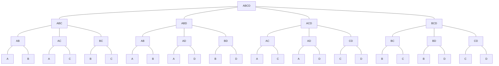
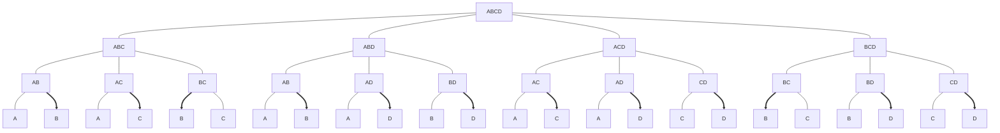
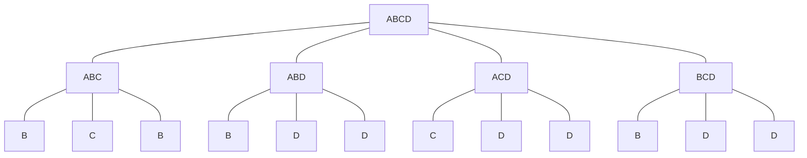
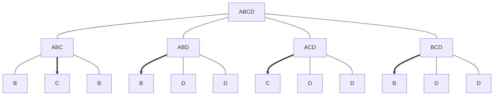
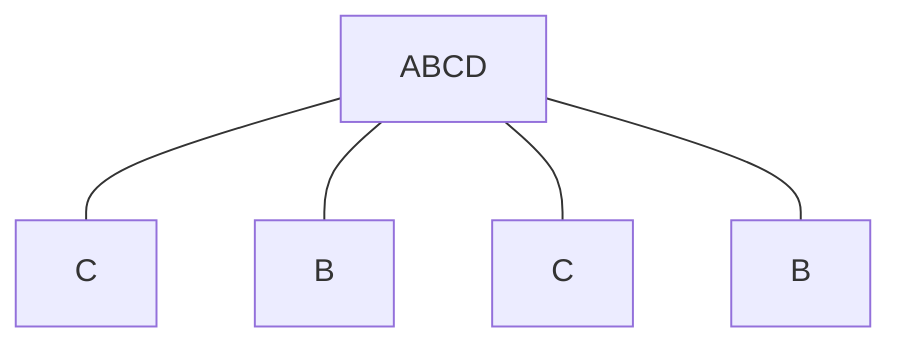

# динамическая теория игр

# Выборы мэра
Допустим, есть четыре кандидата $A,B,C,D$. Есть три голосующих. Первый голосующий вычеркивает одного из кандидатов, затем второй и в конце третий. Побеждает оставшийся кандидат.

Допустим, приоритет у голосующих таков:

| **I** | **II** | **III** |
|---|----|-----|
| A | C  |  D  |
| B | A  |  B  |
| C | B  |  C  |
| D | D  |  A  |

При наивном поведении каждый из голосующих вычеркивает самого худшего по своей версии кандидата.

| **I** | **II** | **III** |
|---|----|-----|
| ~~A~~ | C  |  ~~D~~  |
| ~~B~~ | ~~A~~  |  ~~B~~  |
| C | ~~B~~  |  C  |
| ~~D~~ | ~~D~~  |  ~~A~~  |

Тогда до последнего голосующего дойдет только два кандидата $A$ и $C$, и он вычеркнет $A$. Победит $C$.

Вот, что произойдет, если первый голосующий вычеркнет самого лучшего $A$. 

Тогда для второго голосующего, не зависимо от того, как он выбирает, самым лучшим решением будет вычеркнуть $D$, потому что, если он оставит $D$, победит именно $D$, потому что он в приоритете у третьего голосующего.

Третьему голосующему не остается ничего, кроме как вычеркнуть $C$.

| **I** | **II** | **III** |
|---|----|-----|
| ~~A~~ | ~~C~~  |  ~~D~~  |
| B | ~~A~~  |  B  |
| ~~C~~ | B  |  ~~C~~  |
| ~~D~~ | ~~D~~  |  ~~A~~  |

Исход динамической игры — это не только победивший кандидат, но и **весь путь от начала до конечной точки**.

Методе Цермело состоит в том, что мы смотрим с конца в каждом из случаев что будет делать третий игрок:

так как мы точно знаем, что происходит на последнем уровне, мы можем укоротить дерево игры, убрав на предыдущем уровне тех, кого третий игрок точно вычеркнет:

Получится редуцированное дерево.

После этого смотрим на ходы с точки зрения второго игрока. Так как третий будет в приоритете выбирать $D$, то второй это учитывает. В левых листьях $B$ повторено два раза, а для второго игрока самая лучшая опция — это $C$. И так далее:

Еще раз редуцируем дерево:

Получается, что для первого игрока равнозначно, вычеркивать второго или третьего. По приоритету будет вычеркнут $C$. Ни $D$, ни $A$ в принципе не реализуемы, не зависимо от того, как пошел первый игрок.

# игра "Пираты и золотые слитки"

Есть корабль, на котором есть семь пиратов, которые ранжированы по старшинству $\{1,2,3,4,5,6,7\}$. Они награбили 50 неделимых слитков золота. Нужно их распределить между имеющимися пиратами. 

Процедура такая: по старшинству каждый предлагает свою версию дележа, сначала первый:
$$1:[A_1,A_2,\dots,A_7]$$
Остальные одобряют предложенный вариант или не одобряют. Будем считать, что они это делают последовательно: от первого к последнему.

Если половина или больше из оставшихся пиратов вариант одобряет, то игра заканчивается и дележ происходит. Если половины не набрали, то первого убивают и второй становится первым.
$$2: [A_2',A_3',\dots,A_7']$$
Это продолжается до того, как остаются два последних. Если осталось два последних, то считается, что 6-й сильнее 7-го, поэтому дележ будет $(50,0)$.

Необходимо предсказать ход игры и результат.

Нарисовать ход игры невозможно, потому что количество вариантов огромно.

Предположим, что первые четыре пирата убиты и пятый предлагает некоторый дележ. Как ему добиться максимально возможного количества слитков? Ему нужно одного из оставшихся пиратов подкупить, то есть оставить такое количество слитков, которое тот не сможет получить, если пятого убьют. Понятно, что он будет подкупать седьмого. Получается парадоксальный результат, что дележ $(\_, \_, \_, \_, 49,0,1)$ будет принят.

Теперь ситуация на предыдущем шаге. Что будет делать четвертый, если он знает, что его убьют, если будет реализован дележ на следующем шаге? Он должен добиться, чтобы из трех оставшихся двое его поддержали. Тогда будет такой вариант $(\_, \_, \_, 47,0,1,2)$.

Третий пират будет пытаться подкупить двух из оставшихся: $(\_, \_, 47,0,1,2,0)$.

Второй пират:  $(\_, 46,0,1,2,0,1)$.

Первый пират подкупит одного из двух: $(46, 0,1,0,0,1,2)$.

В этой задаче возникает проблема, когда пиратов больше семи. Потому как в случае семи первый пират подкупает одного из двух. Тогда, если пиратов становится восемь, то первый становится вторым и первому нужно угадать, кого из двух будет подкупать второй. 

Условимся считать, что теперь в конце пираты получают поровну $(\_,\_,\_,\_,\_,25, 25)$.

Пятый пират будет подкупать одного из них, неизвестно какого $(\_,\_,\_,\_,24,0, 26)$ или $(\_,\_,\_,\_,24,26, 0)$.

Тогда четвертый должен подкупать двух: пятого и второго он должен угадать $(\_,\_,\_,24,25,0, 1)$ или  $(\_,\_,\_,24,25,1, 0)$.

Получается, что есть проблема с множественностью равновесий.

# Динамическая игра с совершенной информацией

$\Gamma$ — конечное дерево игры с отмеченной стартовой вершиной, $N$ — список игроков.

Если какая-то вершина в дереве названа стартовой $*$, то это означает, что есть направление движения по дереву. Про каждое ребро дерева можно сказать какая из его вершин ближе к стартовой. Куда бы мы не двигались по дереву, наступит момент, когда дальше двигаться нельзя. Все вершины, из которых идти нельзя, называются терминальными.

$X$  — множество вершин,  $A\subset X\times X$ — множество ребер. Для любой вершины $x$, $A(x)$ — это множество ребер, идущих дальше от вершины $*$. То есть, если какой-то игрок ходит в вершине $x$, то $A(x)$ — это множество его ходов.

Должно быть задано отображение из всех вершин, кроме терминальных, в множество игроков. То есть, нужно сказать, кто ходит в каждой вершине. В терминальных вершинах ходов нет, там игра заканчивается.

Терминальные вершины — это такие вершины из которых нет пути дальше:
$$T = \{x\in X| A(x)=\varnothing\}$$

Чтобы задать игру, нужно для каждой терминальной вершины задать выигрыши игроков:
$$u=: T \rightarrow \mathbb{R}^N, u(t)=(u_1^t,\dots,u_n^t)$$
При этом каждае нетерминальная вершина должна быть помечена одним из игроков: 
$$\iota:X\backslash T\rightarrow \mathbb{N}: X_i=\iota^{-1}(i)=\{x\in X|\text{player i turn}\}$$
Решение в такой игре всегда понимается по принципу Цермело — «с конца». Так как игра конечна, можно посмотреть на предпоследний уровень, то есть такие вершины, из которых все ребра ведут только в терминальные. Для каждой такой вершины известно, кто в ней ходит. Этот игрок сравнивает все векторы выигрышей в терминальных вершинах и выбирает ту, которая принесет максимальный выигрыш.

Принцип Цермело: на предпоследнем уровне стереть все ребра и оставить выигрыши, соответствующие максимальной $i$-й компоненте, где $i$ ходит в рассматриваемой вершине. Проблемы в принципе Цермело начинаются там, где у игрока есть выбор между несколькими ребрами, которые приводят к одинаковому максимальному выигрышу. Формально в этом случае разрешается любым способом выбрать ход. У других игроков нет никакого способа повлиять на выбор этого $i$ игрока. Затем продолжить снизу вверх по индукции.

# Бинарные игры

Бинарные игры — это игры с двумя игроками, в которых один должен выиграть, другой — проиграть.

Есть два игрока $N=\{1,2\}$ и два строго упорядоченных исхода.

