# деревья, эквивалентные определения дерева

Деревом называется такой граф $G=(V,E)$, который связен и ацикличен.

Следующие определения эквивалентны.

1. Граф $G$ — дерево
2. Между любыми двумя вершинами графа $G$ есть единственная простая цепь
3. $G$ связен, число ребер графа $G$ на 1 меньше числа вершин
4. $G$ ацикличен, число ребер графа $G$ на 1 меньше числа вершин

Для доказательство нужно последовательно вывести пункты друг из друга:
$$1 \Rightarrow2\Rightarrow3\Rightarrow 4 \Rightarrow1$$

$1\Rightarrow 2$ $G$  — связен и ацикличен. Очевидно, что простоая цепь между любыми двумя вершинами есть, потому что граф связен. Очевидно, что эта цепь одна, потому что иначе образуется цикл.

$2\Rightarrow 3$ Мы знаем из предыдущего пункта, что у графа $G$ есть ровно одна простая цепь между любыми двумя вершинами. Если мы знаем, что есть простая цепь, то граф очевидно связен.

*Индукция по числу вершин графа* $G$. Пусть $n$ — это количество вершин графа $G$.

*База индукции*. При $n=1$ не может быть ни одного ребра, то есть на 1 меньше. При $n=2$, и существующей простой цепи между этими двумя вершинами, количество ребер оказывается на 1 меньше количества вершин.

*Предположение индукции*. Предположим, что утверждение доказано при всех $k\le n$. Докажем его для случая $k=n+1$. 
Рассмотрим граф $G$, у которого $n+1$ вершин. Про этот граф нам известно, что между любыми двумя его вершинами есть ровно одна простая цепь. В $G$ есть ребра. Рассмотрим одно из ребер.

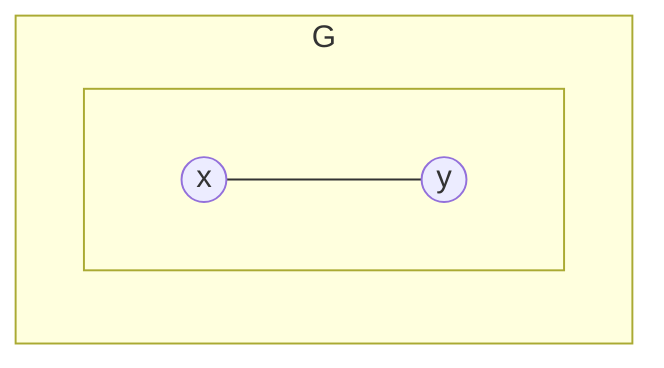
Две вершины $x$ и $y$ соединены ребром и никаких других маршрутов, соединяющих эти две вершины нет. Это означает, что, если удалить ребро $(x,y)$ из графа $G$,  то получится граф $G'$, состоящий из двух компонент связности, и вершины $x$ и $y$ окажутся в разных компонентах.

Пусть граф, содержащий вершину $x$ называется $H_1$, а вершину $y$ — $H_2$. У графа $H_1$ имеется $n_1$ вершин и при этом $n_1 < n+1$. При этом у $H_1$ между двумя вершинами есть ровно одна простая цепь. Применительно к графу $H_1$ мы можем применить предположение индукции, соответственно, он имеет $n_1-1$ ребер. На втором графе $H_2$ количество вершин $n_2$ и при этом $n_2 < n+1$ и количество ребер $n_2-1$.

так как
$$n_1+n_2=n+1$$
У исходного графа $G$ число ребер равно 
$$(n_1-1)+(n_2-1)+1=n1+n2-1$$
Индукция доказана.

$3\Rightarrow 4$ Есть граф $G$, он связен, количество его вершин $n$ на 1 меньше количества ребер. Давайте предположим, что в графе $G$ есть хотя бы один цикл.

Пусть $k$ — это количество вершин в цикле, $k\le n$ — это количество вершин и ребер в цикле.
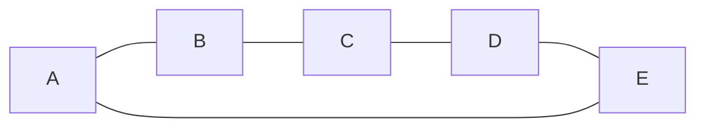
В цикле $k$ вершин, всего в графе $n$ вершин, значит есть еще $n-k$ вершин $\{v_1, \dots, v_{n-k}\}$, которые находятся вне цикла.

Так как граф связный, то для любого $i$ вершина $v_i$ соединена с циклом как минимум одним маршрутом. Выберем среди всех маршрутов, соединяющих вершину $v_i$ с циклом, самый короткий. Возьмем первое ребро этого маршрута. Эти ребра *все* различные. Таких различных ребер $n-k$.

Всего ребер получается
$$\ge(n-k)+k=n$$
Так как изначально было предположено, что всего в графе $n-1$ ребро, это является противоречием. Следовательно, в графе нет циклов.

$4\Rightarrow 1$  Известно, что граф $G$ ацикличен, у него $n$ вершин и $n-1$ ребер. Обозначим $k$ — количество связных компонент в графе $G$ .

$n_1, \dots, n_k$  — это количества вершин в компонентах связности графа $G$.

Cумма количства вершин во всех компонентах равна $n$:
$$n_1+\ldots+n_k=n$$
Обозначим компоненты связности $G_1, \dots, G_k$.

Раз $G_i$ — это компонента связности, то это связный граф, не содержащий циклов. Это означает, что количество ребер на 1 меньше количества вершин $n_i-1$, количество ребер в исходном графе $G$
$$G=(n_1-1)+(n_2-1)+\ldots+(n_k-1)=n_1+\ldots+n_k-k=$$
мы знаем, что у графа $G$ количество ребер равно $n-1$. То есть величина равна
$$= n-1$$
Также мы знаем, что сумма количества вершин на всех компонентах равна $n$. То есть, это означает, что $k=1$

# число деревьев

## Количество деревьев на $n$ вершинах.

Обозначим вершины дерева $\{1, \dots, n\}$

Вот такие графы не равны друг другу:

![[graphs_05.01.png|300]]

пусть $t_n$ — количество деревьев

$t_1$ на одной вершине — одно дерево, $t_2=1$, $t_3=3$, $t_4=16$, $t_5=125$

### Теорема Кэли
$$t_n=n^{n-2}$$
Доказательство (Прюфера).

Рассмотрим множество всех последовательностей длины $n-2$ которые состоят из натуральных чисел $\in\{1,2,\dots\,n\}$, количество таких последовательностей $n^{n-2}$.

Допустим, есть такое дерево:
![[graphs_05.02.jpg|300]]

Во-первых, считаем, что $n\ne 1$. Если у графа больше одной вершины, то у него есть висячие вершины. Среди этих висячих вершин можно найти вершину с наименьшим номером.
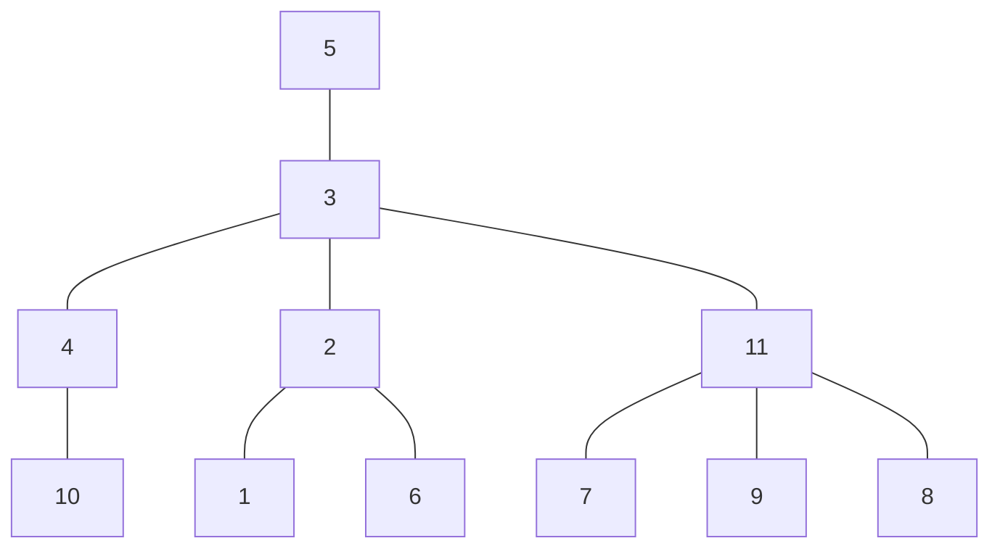

Возьмем лист с наименьшим номером 1. В код Прюфера записываем второй конец висячего ребра, то есть 2 и удаляем ребро и вершину 1.
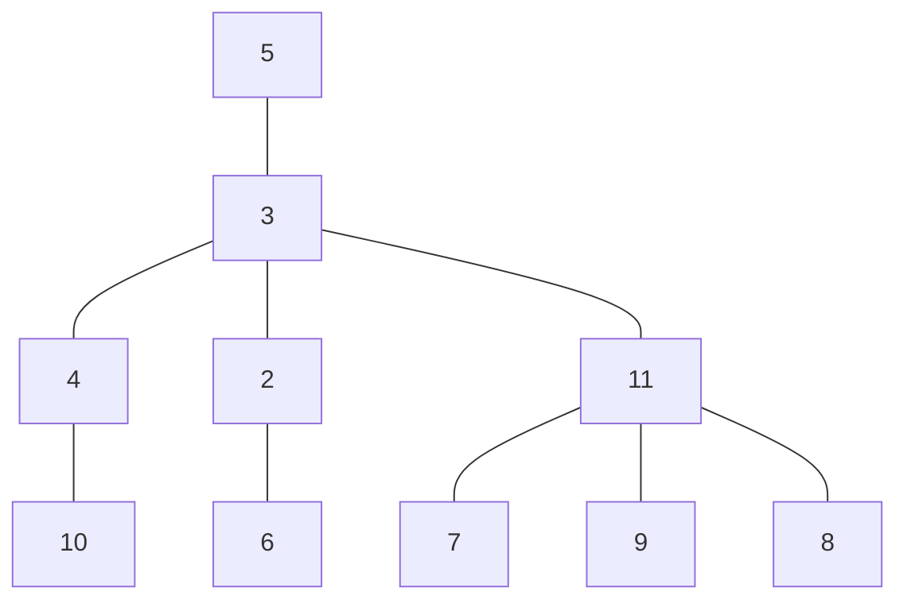
$$2$$Очевидно, что тот граф, который получится на выходе — тоже дерево. Делаем опять ту же самую операцию. Минимальной висячей вершиной будет 5. Берем в код номер 3 и удаляем ребро с вершиной 5
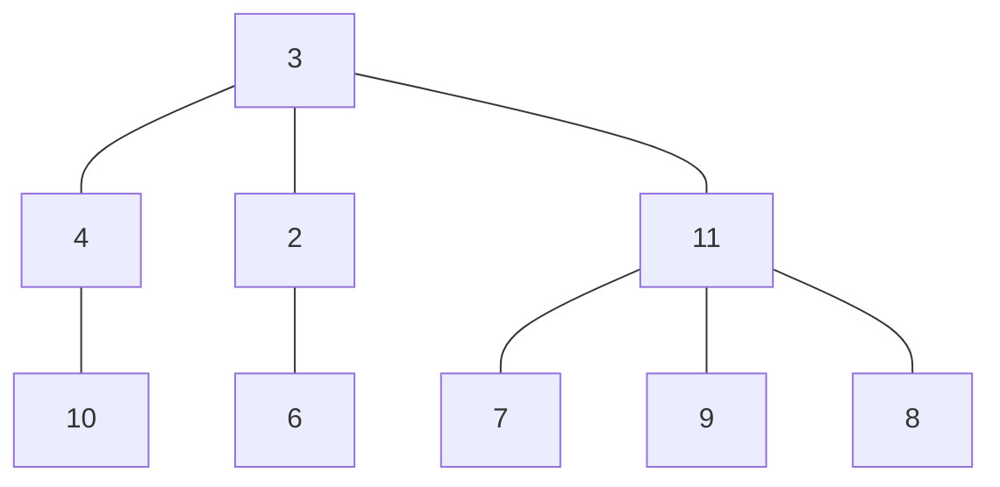
$$2,3$$
Теперь минимальной висячей вершиной будет 6. Берем 2 и удаляем 6:
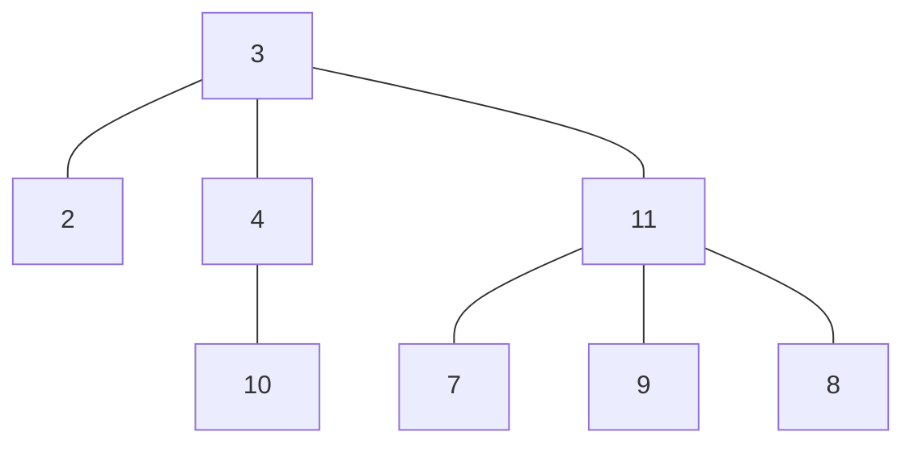

$$2,3,2$$
Вершина 2 становится висячей и минимальной. Берем три и удаляем ребро и 2:
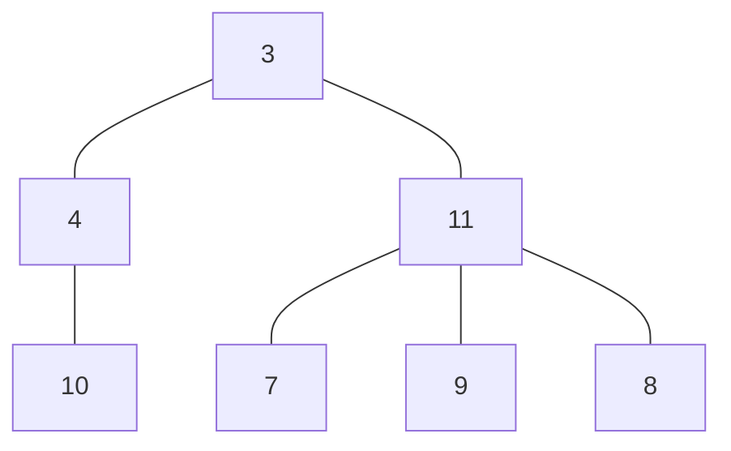
$$2,3,2,3$$
Теперь берем вершину 7, выписываем 11 и удаляем 7:
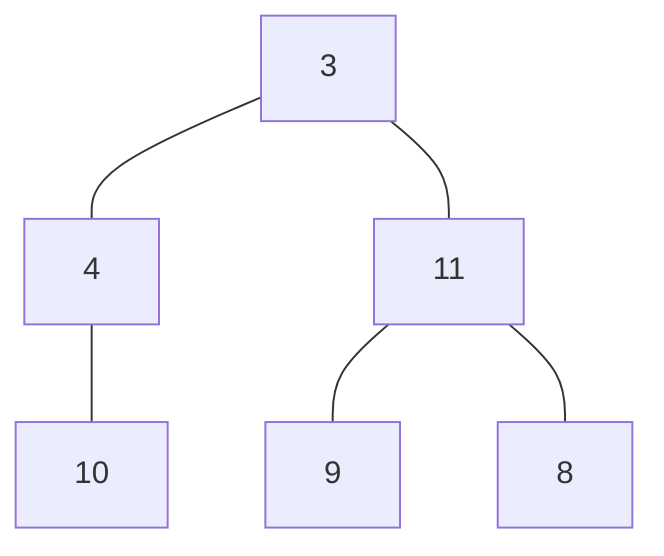
$$2,3,2,3,11$$
Теперь 8 и 11:
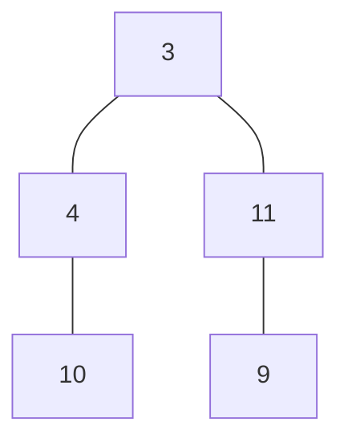
$$2,3,2,3,11,11$$
Теперь 9 и 11: 
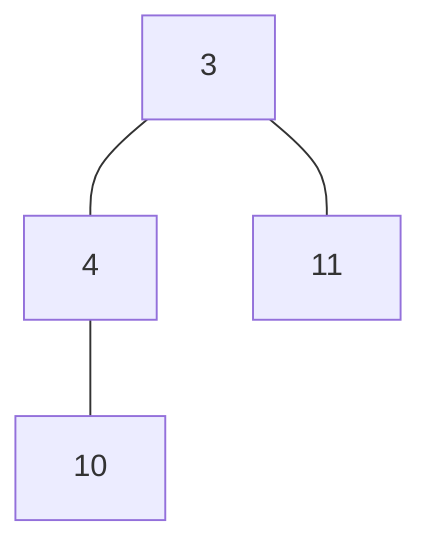
$$2,3,2,3,11,11,11$$
теперь 10 и 4
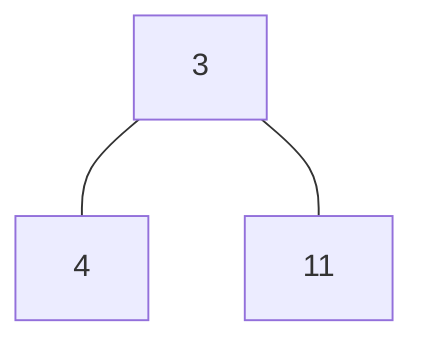
$$2,3,2,3,11,11,11,4$$
теперь 4 и 3
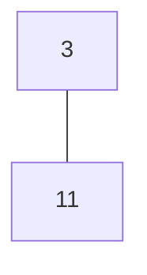
$$2,3,2,3,11,11,11,4,3$$
с последним ребром ничего не делаем.

Очевидно, что для разных деревьев коды разные.

### Процедура декодирования

Возьмем последовательность
$$\begin{aligned}
&1,2,3,4,5,6,7,8,9,10,11 \\
&2,3,2,3,11,11,11,4,3
\end{aligned}$$
и последовательность натуральных чисел по количеству вершин

Выберем число с самым маленьким номером, которое отсутствует в коде, это 1, и выберем 2 из кода
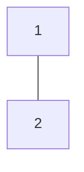
вычеркнем эти два числа
$$\begin{aligned}
&\cancel{1},2,3,4,5,6,7,8,9,10,11 \\
&\cancel{2},3,2,3,11,11,11,4,3
\end{aligned}$$
опять есть минимальное число, которое отсутствует в коде, это 5. Выбираем 5 и 3
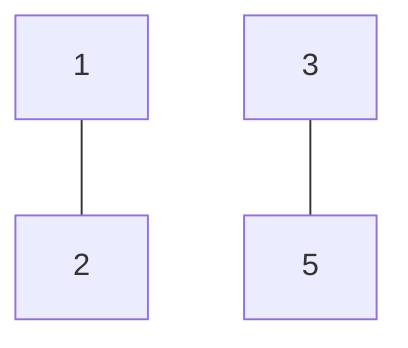
вычеркиваем
$$\begin{aligned}
&\cancel{1},2,3,4,\cancel{5},6,7,8,9,10,11 \\
&\cancel{2},\cancel{3},2,3,11,11,11,4,3
\end{aligned}$$
выбираем 6 и 2
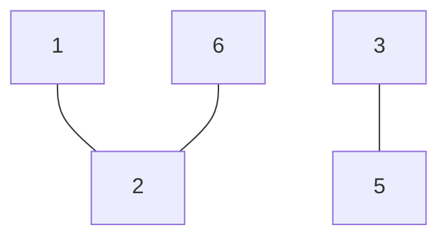
вычеркиваем
$$\begin{aligned}
&\cancel{1},2,3,4,\cancel{5},\cancel{6},7,8,9,10,11 \\
&\cancel{2},\cancel{3},\cancel{2},3,11,11,11,4,3
\end{aligned}$$

В рамках этой процедуры будет построено $n-1$ ребро на $n$ вершинах.