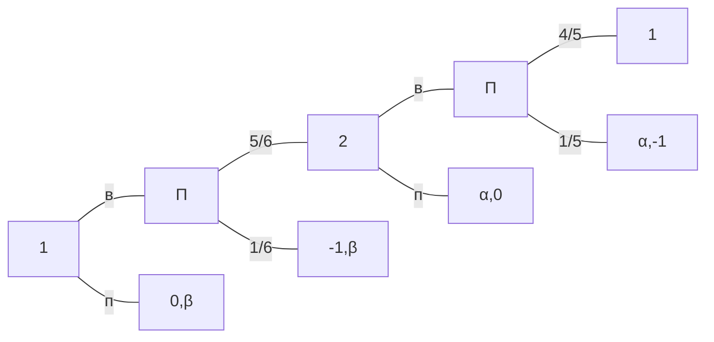
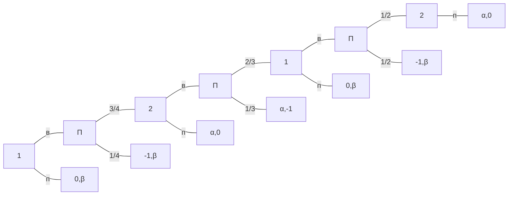
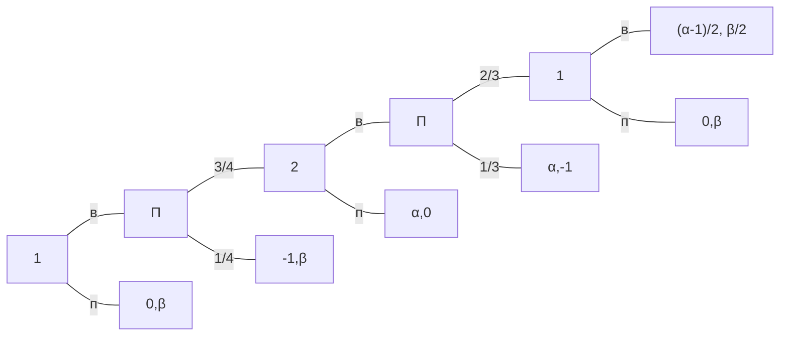
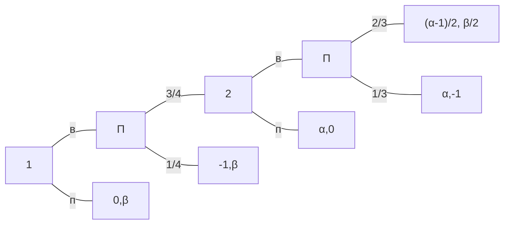
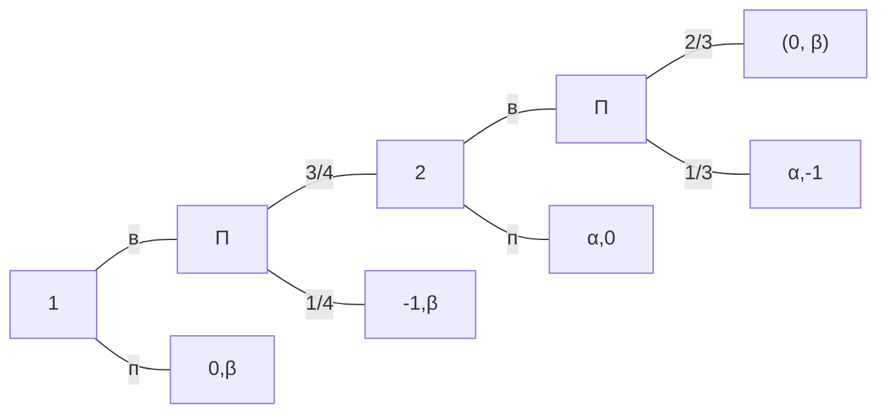
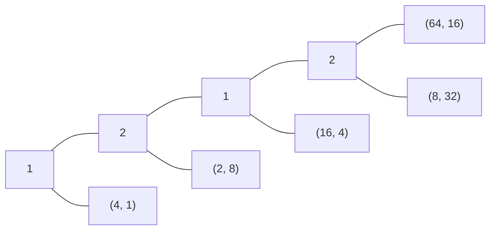
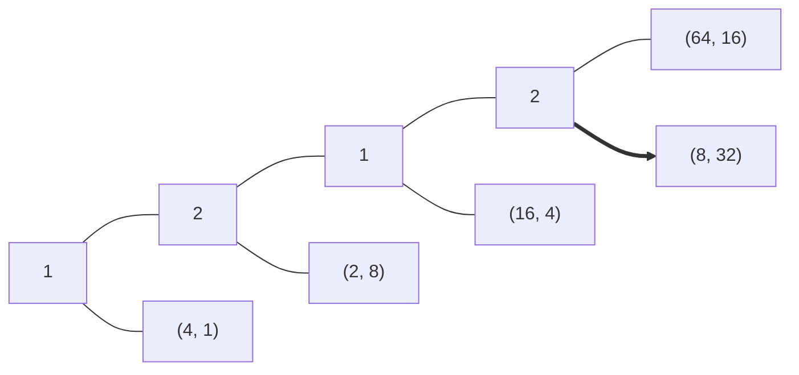
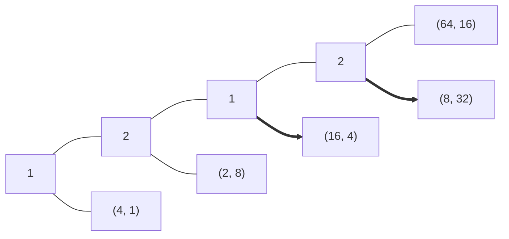
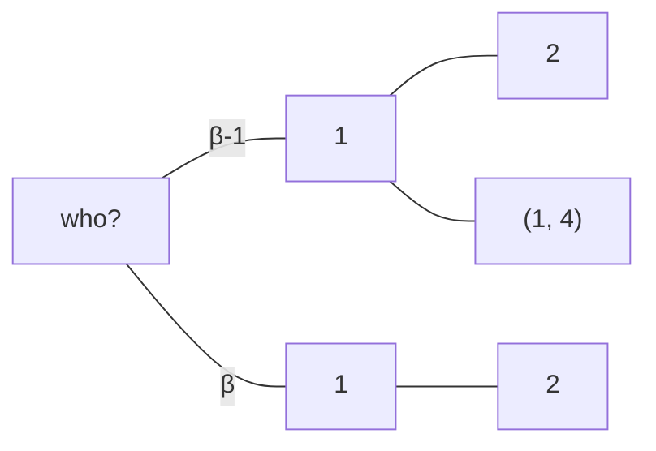

# учет случайности

# русская рулетка

Для каждого игрока возможны три исхода: смерть, кабак и принцесса. Пусть смерть будет -1, кабак — 0, тогда принцесса будет положительным выигрышем

| смерть | кабак | принцесса |
| ------ | ------| ----------|
|     1  |   0   |     $\alpha > 0$     |
|     1  |   0   |     $\beta > 0$     |

Проблема будет в том случае, если $\alpha$ и $\beta$ будут в точности совпадать с вероятностью проигрыша. В этом случае проблема та же, что и с принципом Цермело: разные ходы будут вести к разным выигрышам у одних и тех же игроков.

Предположим, что первые два хода сделаны. 

Заменим вист первого игрока на последнем шаге на мат ожидание

Теперь все зависит от того $\alpha$ больше или меньше единицы.

Если $\alpha>1$

В этом случае на последнем шаге будет стоять выигрыш
$$\frac{1}{3}(\alpha,-1)+\frac{2}{3}\bigg(\frac{\alpha-1}{2},\frac{\beta}{2}\bigg)=\frac{1}{3}(\alpha,-1)+\bigg(\frac{2\alpha-1}{3},\frac{\beta-1}{3}\bigg)$$
и здесь тоже все зависит от того, $\beta$ больше единицы или меньше.

Если $\alpha<1$

В этом случае на последнем шаге будет стоять выигрыш
$$\frac{1}{3}(\alpha,-1)+\frac{2}{3}(0,\beta)=\bigg(\frac{\alpha}{3},-1\bigg)+\bigg(0, \frac{2\beta-1}{3}\bigg)$$
и здесь все зависит от того, $\beta$ больше $1/2$ или меньше.

# ультиматум

Одному игроку дают денежную единицу. Есть второй игрок, который еще ничего не получает. 
$$(1,0)$$
У первого есть ход: предложить некоторый дележ 
$$(1-x,x)$$
Второй должен одобрить или не одобрить. Если второй говорит нет, то все деньги изымаются.

Прицип Цермело говорит, что первый выберет вариант $(1,0)$, потому что это единственное равновесие.

# сороконожка

Меценат предлагает первому игроку 4 рубля, при этом второй получит 1.
$$(4,1)$$
Если первый откажется, то второй получит 8 рублей, а первый 2  
$$(2,8)$$
Если второй откажется, то первому будет предложено 16, а второму — 4.
$$(16,4)$$
Далее 8 и 32
$$(8, 32)$$
Далее 64 и 16
$$(64,16)$$
Получается схема

Принцип Цермело говорит, что на последнем ходе второй выберет 32, не обращая внимания на то, сколько выиграет первый

Очевидно, что на предыдущем шаге первый, выбирая между 16 и 8 выберет 16

Тогда второй на втором шаге сравнивает 4 и 8

а первый на первом шаге сравнивает 4 и 2

Получается, что до больших цифр никто не доходит, а игра останавливается на первом шаге.

## Несовершенная информация

Предположим, что два взаимодействующих между собой игрока взяты из разных популяций: один всегда максимизирует свой выигрыш, второй — из популяции, где встречаются альтруисты (их процент в популяции $\beta$).

Первый игрок не знает, с кем имеет дело.

Если окажется, что второй игрок из популяции $\beta$, то во второй ветке игра продлится до самого конца, потому что второй будет передавать ход дальше

Однако, если ветка верхняя, то продвинуться дальше первого хода первый игрок может только в том случае, если второй игрок, преследуя свои цели, притворился членом популяции $\beta$ . Тогда второй заберет себе 32.

Возникает информационное множество. Первый не знает, в какой ветке он находится, поэтому не знает, как следует ходить.